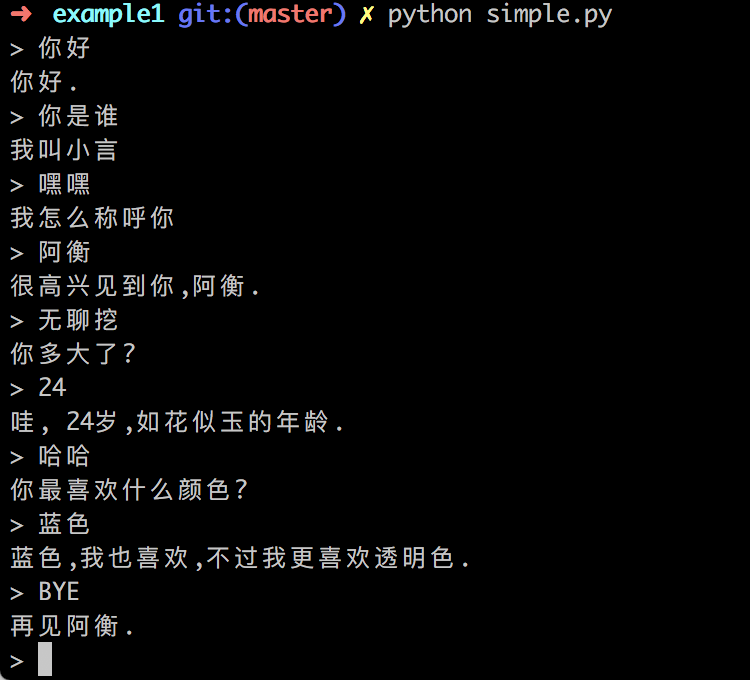
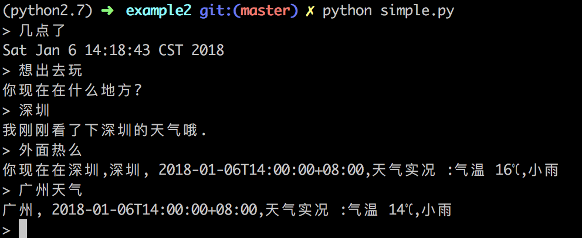
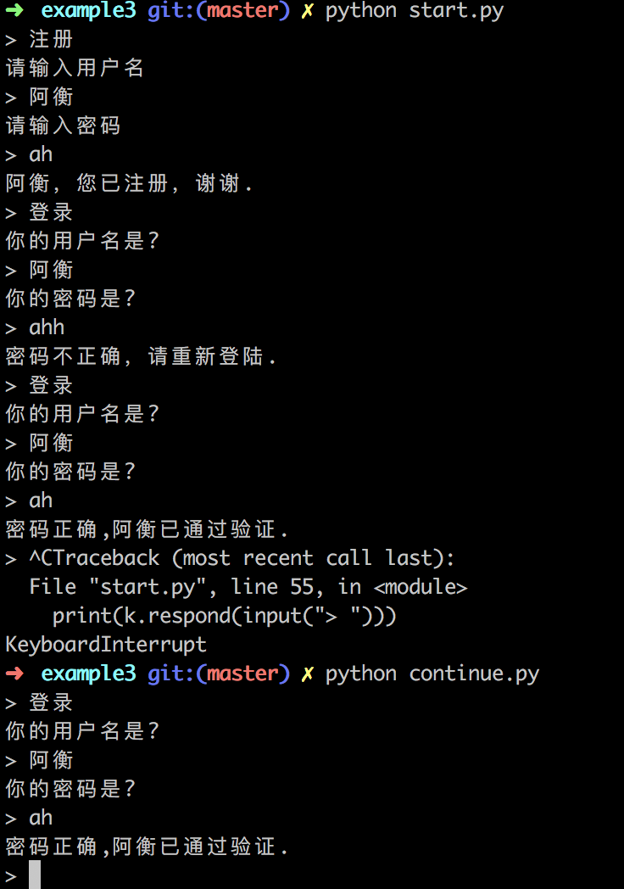
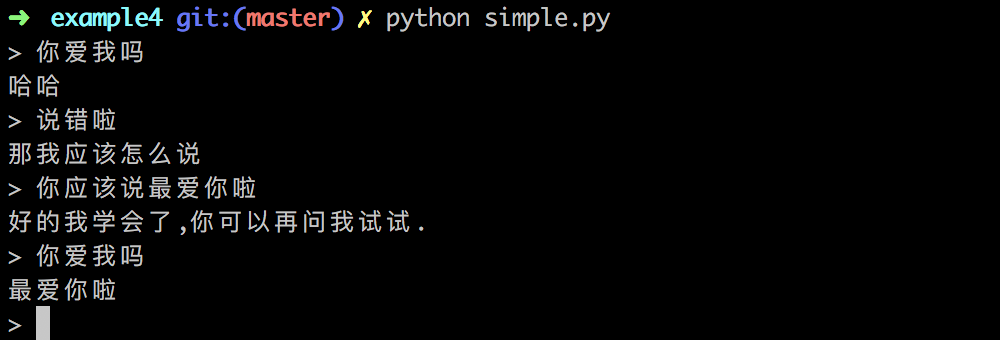

# python-aiml

***********

This is a fork of the [paulovn/python-aiml](https://github.com/paulovn/python-aiml) Python AIML interpreter. It has been
refactored to make it 

1. support Chinese
2. support both Python 2.7 and Python 3.

Part of the idea and example are from [andelf/PyAIML](https://github.com/andelf/PyAIML/tree/9b46392935d223358f922c365a9ecb7ecbadc7ea). 

PyAIML is (c) Cort Stratton. *python-aiml* uses the same license as PyAIML 
(2-clause BSD), except for the ALICE AIML files taken from the [Free ALICE AIML set](https://code.google.com/archive/p/aiml-en-us-foundation-alice/), which are licensed with the [LGPL](http://www.gnu.org/licenses/lgpl.html) license.


Install
=======
```
git clone https://github.com/paulovn/python-aiml.git
python setup.py build
python setup.py install
```

Usage
=======
Quick & dirty example (assuming you've downloaded the "alice" AIML set):
```
import aiml
import os

# the path where your AIML startup.xml file located
chdir = os.getcwd()

k = aiml.Kernel()

# for alice
k.bootstrap(learnFiles="std-startup.xml", commands="load aiml b, chdir=chdir)

# if python 2
# while True: print(k.respond(raw_input("> ")))
# if python 3
while True: print(k.respond(input("> ")))
```


Quick & dirty example (assuming you've downloaded the "cn-examples" AIML set):
first ``cd cn-examples``
```
import aiml
import os

# the path where your AIML startup.xml file located
chdir = os.getcwd()

k = aiml.Kernel()

# for chinese
k.bootstrap(learnFiles="cn-startup.xml", commands="load aiml cn", chdir=chdir)

# if python 2
# while True: print(k.respond(raw_input("> ")))
# if python 3
while True: print(k.respond(input("> ")))

```

See ``Examples`` for details.

# Examples
Some specific examples:

**/example1:** 



**/example2:** 



**/example3:** 
Run ``python start.py`` first and then run ``python continue.py``. 
Example3 does not work for python2 due to shelve sync issue.



**/example4:** 




Scripts
=======

Two small scripts are added upon installation:

* ``aiml-validate`` can be used to validate AIML files
* ``aiml-bot`` can be used to start a simple interactive session with a bot,
  after loading either AIML files or a saved brain file.


Datasets
========

The installation includes two AIML datasets:

* The *standard* AIML set, as it was included in PyAIML
* The `Free ALICE AIML set`_ v. 1.9, taken from the data published by the
  `ALICE AI Foundation`_ (with a few small fixes in files that did not 
  validate as `AIML 1.0.1`_)

They can be loaded via the ``bootstrap`` method in the ``Kernel`` class. See 
the `bot.py`_ script for an example.

Tests
=====

There are a number of unit tests included (in the ``test`` subdirectory); they 
can be executed by the setup infrastructure as:

```
python setup.py test
```

or they can also be launched by directly calling:

```
python test [testname ...]
```

This last version allows executing only some of the test files by explicitly naming them in the command line; if none is specified all will be executed.

- [PyAIML](https://github.com/cdwfs/pyaiml)
- [Free ALICE AIML set](https://code.google.com/archive/p/aiml-en-us-foundation-alice/)
- [LGPL](http://www.gnu.org/licenses/lgpl.html)
- [ALICE AI Foundation](http://alice.pandorabots.com/)
- [AIML 1.0.1](http://www.alicebot.org/TR/2011/)


